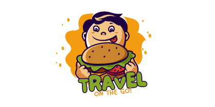

# TravelOnTheGo



## 📱 Live Demo

[Visit TravelOnTheGo](https://travel-on-the-go.netlify.app/)

## 📖 Overview

TravelOnTheGo is a comprehensive travel companion application designed to help users discover local attractions, plan itineraries, navigate unfamiliar locations, and share their experiences. The platform combines location-based recommendations, interactive maps, AI-powered itinerary generation, and user feedback to create a seamless travel experience.

## ✨ Features

### 🏙️ Top Places
- Discover popular attractions, restaurants, and points of interest
- Filter places by ratings, categories, and distance
- View detailed information including photos, ratings, and descriptions
- Responsive card-based UI for easy browsing

### 🗺️ Interactive Maps
- Explore locations with an interactive map interface
- Find nearby attractions and points of interest
- Get directions and distance information
- Visual representation of recommended places

### 📅 AI-Powered Itinerary Generator
- Create personalized travel itineraries based on:
  - Destination
  - Available time
  - Travel radius
  - Personal preferences
- Gemini 2.0 Flash LLM integration for intelligent suggestions
- Time-optimized routes between attractions
- Customizable itineraries that can be saved and shared

### 💬 User Feedback System
- Share experiences and recommendations
- Rate visited places and attractions
- Submit detailed feedback with photos
- Help improve recommendations for other travelers

### 🔍 Smart Search
- Powerful search functionality with real-time results
- Search for specific places, cuisines, or attractions
- Filter search results by various criteria
- Mobile-optimized search experience

### 👤 User Profiles
- Personalized user accounts
- Save favorite places and itineraries
- Track visit history
- Customize preferences for better recommendations

## 🛠️ Technology Stack

### Frontend
- **React.js**: Modern component-based UI library
- **Tailwind CSS**: Utility-first CSS framework for responsive design
- **Headless UI**: Accessible UI components
- **React Router**: Navigation and routing
- **Axios**: HTTP client for API requests

### Backend
- **Node.js**: JavaScript runtime for server-side logic
- **Express.js**: Web application framework
- **MongoDB**: NoSQL database for flexible data storage
- **JWT**: Secure authentication and authorization

### APIs & Services
- **Google Maps API**: Location data and mapping functionality
- **Gemini 2.0 Flash LLM**: AI-powered itinerary generation
- **Cloudinary**: Image storage and optimization

### DevOps
- **Netlify**: Frontend deployment and hosting
- **Render**: Backend deployment and hosting
- **MongoDB Atlas**: Cloud database service
- **GitHub Actions**: CI/CD pipeline

## 📋 Installation & Setup

### Prerequisites
- Node.js (v14.0.0 or later)
- npm (v6.0.0 or later)
- MongoDB (local or Atlas connection)
- Google Maps API key
- Gemini API key

### Clone the Repository
```bash
git clone https://github.com/AaryaBhutkar/TravelOnTheGo.git
cd TravelOnTheGo
```

### Environment Variables
Create `.env` files in both client and server directories:

#### Client (.env)
```
REACT_APP_BACKEND_URL=http://localhost:5000
REACT_APP_GOOGLE_MAPS_API_KEY=your_google_maps_api_key
```

#### Server (.env)
```
PORT=5000
MONGODB_URI=your_mongodb_connection_string
JWT_SECRET=your_jwt_secret
GEMINI_API_KEY=your_gemini_api_key
```

### Install Dependencies
```bash
# Install server dependencies
cd server
npm install

# Install client dependencies
cd ../client
npm install
```

### Run the Application
```bash
# Run server (from server directory)
npm run dev

# Run client (from client directory)
npm start
```

The application will be available at `http://localhost:3000`

### Deployment

#### Frontend (Netlify)
1. Connect your GitHub repository to Netlify
2. Configure build settings:
   - Build command: `cd client && npm install && npm run build`
   - Publish directory: `client/build`
3. Configure environment variables in the Netlify dashboard

#### Backend (Render)
1. Create a new Web Service in Render dashboard
2. Connect to your GitHub repository
3. Configure the service:
   - Build command: `cd server && npm install`
   - Start command: `cd server && npm start`
4. Add environment variables in the Render dashboard

## 📱 Mobile Responsiveness

TravelOnTheGo is designed to be fully responsive across all device sizes:

- **Desktop**: Full-featured experience with expanded layout
- **Tablet**: Optimized layout with adjusted components
- **Mobile**: Streamlined interface with touch-friendly elements
  - Centered navigation
  - Optimized search experience
  - Touch-friendly UI elements
  - Simplified maps view

## 🤝 Contributing

We welcome contributions to TravelOnTheGo! Please follow these steps:

1. Fork the repository
2. Create a feature branch (`git checkout -b feature/amazing-feature`)
3. Commit your changes (`git commit -m 'Add some amazing feature'`)
4. Push to the branch (`git push origin feature/amazing-feature`)
5. Open a Pull Request

Please ensure your code follows our coding standards and includes appropriate tests.

## 📄 License

This project is licensed under the MIT License - see the [LICENSE](LICENSE) file for details.

## 🙏 Acknowledgements

- [Google Maps Platform](https://developers.google.com/maps)
- [Gemini AI](https://ai.google.dev/)
- [React.js](https://reactjs.org/)
- [Tailwind CSS](https://tailwindcss.com/)
- [Express.js](https://expressjs.com/)
- [MongoDB](https://www.mongodb.com/)
